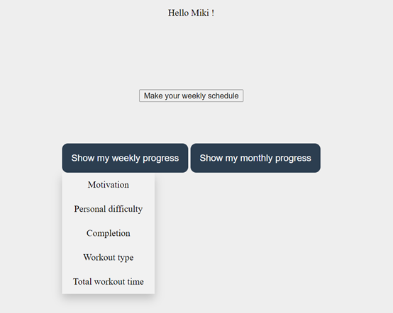
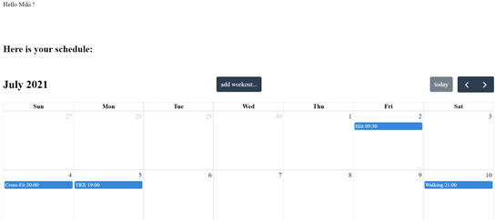
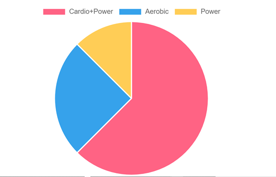
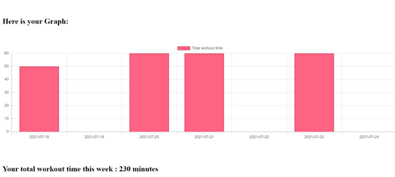
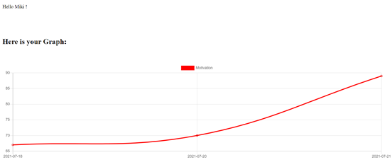

# My FULLSTUCK Project - FitFriend:

**FitFriend**: a website that lets you create and manage workout routines!

*I planned, designed and programmed this project from start to finish.*

***Back-End: Python Flask***

***Front-End: Html with Java Script***

**Basic usage description:**

A user can log in, fill out his personal training calendar,
After each training session, the user will fill out a training report.
The site presents weekly and monthly statistics on the trainee's motivation levels, overall training time, types of training and more.

### Project Features:

•Feature 1: Add training to the schedule

•Feature 2: Deleting a workout from the schedule

•Feature 3: Fill out a training report

•Feature 4: View weekly statistics

•Feature 5: View monthly statistics

**Credits**:
This project was done as part of the **Shecode** organization.
Thank you Masha for being my mentor!

